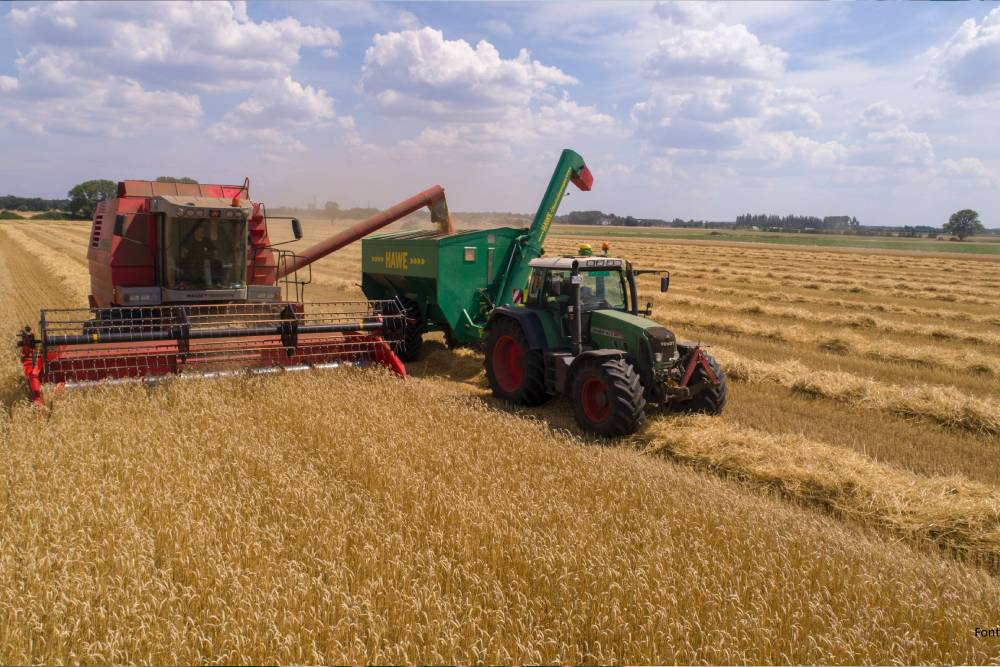

Para quem é produtor rural, Funrural é uma palavra que faz parte do vocabulário e que muitas vezes causa um desconforto.

É possível reduzir o custo com o Funrural? A resposta direta é: “Sim”. Veja a seguir como você pode fazer um planejamento e reduzir o custo com esse fundo.

<!--more--> 

O que é Funrural?
**Funrural** (Fundo de assistência ao trabalhador rural), é um imposto de contribuição previdenciária para o **INSS, RAT** (risco ambiental do trabalho) e **SENAR** (serviço de aprendizagem rural) pago pelo produtor rural, que incide na receita bruta resultante da comercialização da produção rural.

Não incide em atividades que não são consideradas rurais, dentre elas: industrialização de bebidas alcoólicas em geral, óleos essenciais, pescado in natura, receitas decorrentes da venda de recursos minerais extraídos de propriedade rural e outros conforme estabelecido pela instrução normativa de 2001.

Apesar de ser uma contribuição social previdenciária, não garante a aposentadoria do produtor, assim é necessário o pagamento individual do INSS para usufruir o benefício da aposentadoria.

Como economizar
No mês de janeiro, o produtor informa ao governo como será pago esse imposto durante o ano, se incidirá sobre a folha de pagamento ou sobre o valor da venda da produção rural. Isso permite avaliar o que será mais vantajoso para o produtor.

Para o produtor que tem poucos funcionários, mas tem um bom volume de venda no ano, pode ser melhor optar pelo desconto do Funrural em folha de pagamento, mas para o produtor que tem muitos funcionários, essa opção **talvez** não será a melhor, por isso antes de tomar uma decisão, converse com seu contador.

Vale lembrar que a opção escolhida em janeiro ficará vigente até dezembro e **não informar qual a forma de recolhimento será a escolhida, fará com que a Receita Federal recolha o Funrural no momento da venda da produção.**

Veja uma situação hipotética: O produtor rural, vai definir qual opção de recolhimento de Funrural será feita no ano de 2021. Usando a tabela abaixo, ele faz uma comparação entre as vendas de produção rural e o que foi gasto com folha de pagamento em 2020. Assim é possível ver que a melhor opção para o ano de 2021, para esse produtor, será o recolhimento do Funrural em folha de pagamento.

Ao tirar um tempo para avaliar qual forma de pagamento do Funrural é mais econômica, você que é Produtor Rural, poderá economizar um valor considerável que pode ser investido no seu negócio.

Vale lembrar que a lei do Funrural é bem complexa e está cheia de reedições e a Receita Federal ainda está em fase de adaptação do seu sistema, por isso não deixe de falar com o seu contador antes de tomar qualquer decisão.

E se você quiser ter acesso à uma planilha para calcular qual das duas opções de recolhimento do Funrural é mais vantajosa para o seu negócio, entre em contato conosco.