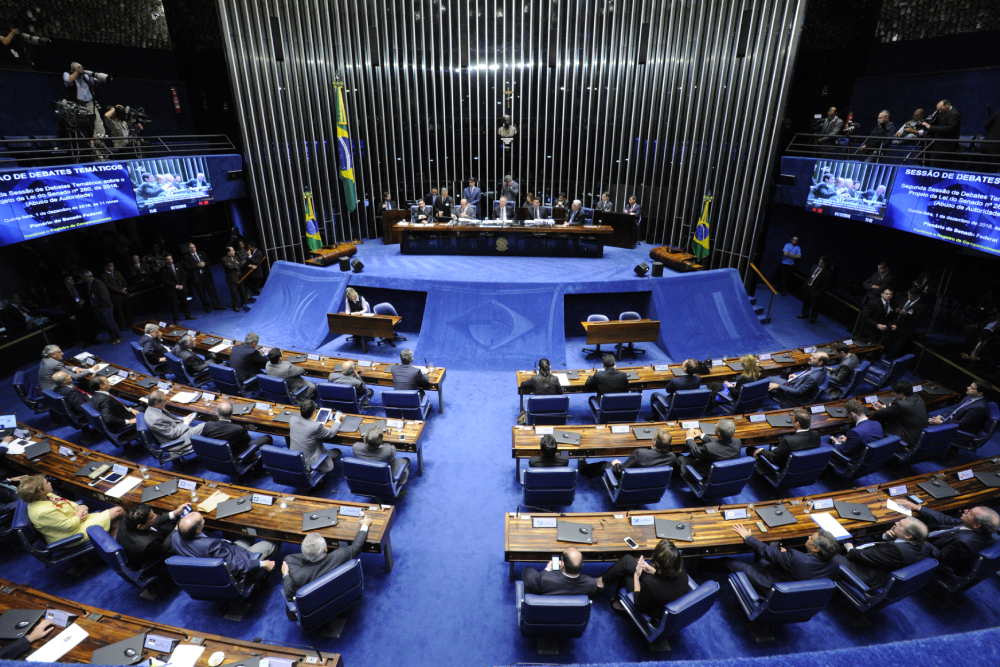

Está em fase de aprovação o Projeto de Lei 458/2021 que institui o Regime Especial de Atualização e Regularização Patrimonial (REARP) para atualização, por pessoa física, do valor de bens móveis e imóveis adquiridos com recursos de origem lícita e localizados no território nacional, e regularização, por pessoa física ou jurídica, de bens ou direitos de origem lícita que não tenham sido declarados ou tenham sido declarados com omissão ou incorreção em relação a dados essenciais.

<!--more--> 

O projeto de lei é de autoria do Senador Roberto Rocha, mas sofreu importantes alterações ao ser aprovado pelo Senado. No projeto primitivo o Senador intitulou o programa de Regime Especial de Atualização Patrimonial (REAP), sendo alterado para Atualização e Regularização do patrimônio registrado na Receita.

Outra importante alteração no projeto primitivo é a alíquota, já que no texto originário era de 1,5% e no texto aprovado pelo Senado, no caso de atualização, é de 3%.

O projeto aprovado pelo Senado, que foi para votação na Câmara dos Deputados, teve nove propostas emendas e foi aprovado no último dia 23 de abril de 2021.

O projeto deve ser votado pela Câmara do Deputados e, caso não haja alteração, ser submetido à sanção presidencial. Em caso de alteração no texto, o projeto deve retornar ao Senado.

Ao todo são 14 artigos que disciplinam a possibilidade de o contribuinte atualizar o valor ou regularizar seus bens e direitos perante a Receita Federal com uma alíquota abaixo da vigente.

Segundo o artigo primeiro da atual proposta, a adesão ao REARP permite a opção pelas seguintes modalidades:

- Atualização do valor de bens móveis e imóveis localizados no território nacional e;
- Regularização de bens ou direitos que não tenham sido declarados ou tenham sido declarados com omissão ou incorreção em relação a dados essenciais.

A atualização do valor dos bens móveis e imóveis, desde que adquiridos com recursos de origem lícita até o dia 31 de dezembro de 2020, será permitida para os proprietários, promitentes compradores ou detentores de título e para inventariantes de espólio cuja sucessão tenha sido aberta até a data da opção pela atualização.

A diferença entre o valor do bem móvel ou imóvel atualizado e o seu custo de aquisição será considerada acréscimo patrimonial, sujeitando-se a pessoa física ao pagamento do Imposto de Renda à alíquota de 3% (três por cento) sobre o ganho de capital.

Entretanto, não se aplica aos bens móveis ou imóveis alienados anteriormente à data de opção pela atualização e se aplica, em caso de imóveis rurais, somente à terra nua.

Quem optar por atualizar o valor dos bens e direitos não poderá, sob pena de desconsideração do REARP, alienar o imóvel no período de três anos, salvo em casos expressamente previstos.

Quanto à regularização de bens e direitos aplica-se aos bens ou direitos de origem lícita, mantidos no Brasil, que não tenham sido declarados ou tenham sido declarados com omissão ou incorreção em relação a dados essenciais.

O montante dos ativos objeto de regularização será considerado acréscimo patrimonial adquirido em 31 de dezembro de 2020, ainda que nessa data não exista saldo ou título de propriedade, sujeitando a pessoa, física ou jurídica, ao pagamento do Imposto sobre a Renda, a título de ganho de capital, à alíquota de 15% (quinze por cento). Além do imposto apurado, incidirá, segundo a proposta, multa de 15% sobre o valor do imposto.

Em caso de aprovação, a adesão deverá ser feita em até 210 (duzentos e dez) dias, contados a partir da data de entrada em vigor da lei, e poderá ser parcelado em até 36 (trinta e seis) vezes, ressalvada algumas regras inerentes ao parcelamento.

O pagamento integral do tributo apurado e o cumprimento das demais condições extingue a punibilidade de possíveis crimes.

O projeto, como bem registrou o Senador Roberto Rocha em suas justificativas, vem sanar a ausência de previsão legal de atualização do custo de aquisição de imóvel a preço de mercado e também permite uma arrecadação considerável de forma antecipada e voluntária aos cofres do governo.